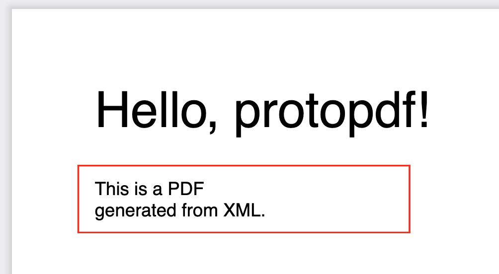
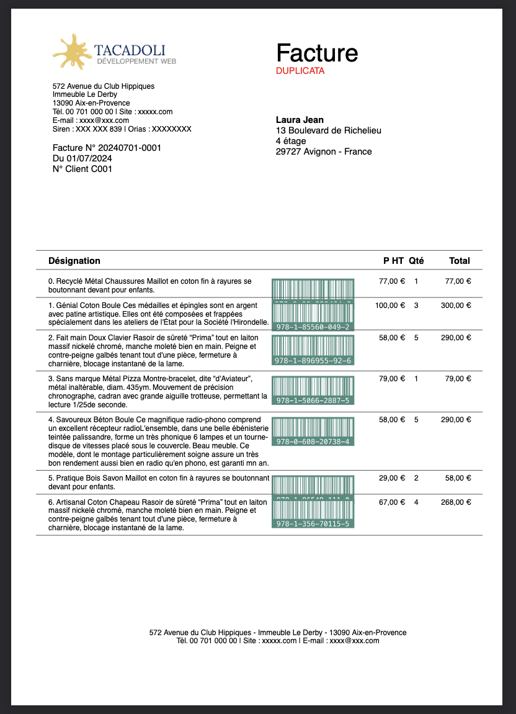
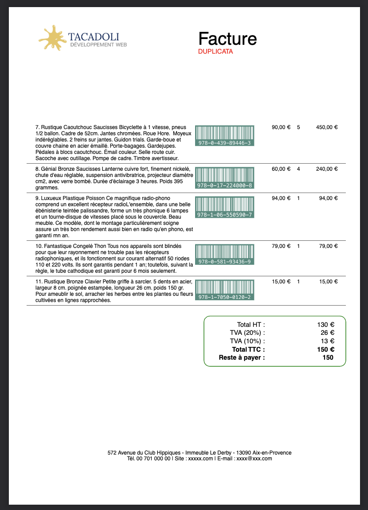

# protopdf

Describe your PDF template in a simple XML format (with styles, variables, loops, and conditions) and generate a PDF from it. 
You can create complex layouts with text, images, QR codes, barcodes, and vector graphics. Create invoices, reports, certificates, and more, now !

> **This project is in early development stage.**
> Feel free to contribute.

## 📦 Installation

```bash
npm install protopdf
```

## 🚀 Usage

```javascript
const { protopdf } = require('protopdf');

let xml = `
<document>
    <styles>
        <style name="title" size="30" font="Helvetica-Bold" />
        <style name="standard" size="11" font="Helvetica" color="black" />
    </styles>

    <page size="A4" layout="portrait" margins="{ top: 0, bottom: 0, left: 0, right: 0 }">
        <text style="title" x='50' y='50'>Hello, {{name}}!</text>
        <declare var="posY" val="{{lastY}}+20" />
        <text style="standard" x='50' y='{{posY}}'>
            This is a PDF
            generated from XML.
        </text>
        <rect x='40' y='{{posY}}-10' w='200' h='{{lastY}} - {{posY}} + 15' strokeColor='red' />
    </page>
</document>
`;

// or get the XML from a file
// let xml = fs.readFileSync('test/test.xml', 'utf8');

protopdf(xml, {
    name: 'protopdf'
}).toFile('test/test.pdf')

// or get the PDF as a data URL
// .toDataURL().then(dataUrl => {
//     console.log(dataUrl);
// });

// or stream it to HTTP response
// .toStream(res)
```

#### and the result will be:




## 💎 Table of contents
- [protopdf](#protopdf)
  - [📦 Installation](#-installation)
  - [🚀 Usage](#-usage)
      - [and the result will be:](#and-the-result-will-be)
  - [💎 Table of contents](#-table-of-contents)
  - [📙 XML Syntax](#-xml-syntax)
    - [Document](#document)
    - [Styles](#styles)
      - [Font](#font)
    - [Page](#page)
    - [Text](#text)
    - [Image](#image)
    - [QRCode](#qrcode)
    - [Barcode](#barcode)
    - [Paths](#paths)
    - [Line (vector graphic)](#line-vector-graphic)
    - [Rect (vector graphic)](#rect-vector-graphic)
    - [RoundedRect (vector graphic)](#roundedrect-vector-graphic)
    - [Ellipse (vector graphic)](#ellipse-vector-graphic)
    - [Circle (vector graphic)](#circle-vector-graphic)
    - [Pagebreak](#pagebreak)
    - [Declare](#declare)
    - [If](#if)
    - [For](#for)
    - [Variables](#variables)
      - [Special variable `lastY`](#special-variable-lasty)
    - [Origin transformations](#origin-transformations)
      - [Origin `translate`](#origin-translate)
      - [Origin `rotate`](#origin-rotate)
      - [Origin `scale`](#origin-scale)
      - [Origin `reset`](#origin-reset)
    - [Section](#section)
  - [⚠️ Sample for a complexe invoice](#️-sample-for-a-complexe-invoice)
  - [To do](#to-do)

## 📙 XML Syntax

> This library use pdfkit ([https//pdfkit.org](https://pdfkit.org/)) to generate the PDF. You can use all the pdfkit parameters in the XML attributes for text and image elements.

### Document

The document is the root element of the XML file. It contain the others elements. It is required and unique.

```xml
<document>
    <!-- other elements -->
</document>
```

### Styles

The styles element contains the styles that can be used in the document. Each style has a name and can have the following attributes: 
- `name` (string) required, a unique name for the style,
- `size` (number) default: 12, a font size,
- `font` (string) default: "Helvetica", one of : 'Courier', 'Courier-Bold', 'Courier-Oblique', 'Courier-BoldOblique', 'Helvetica', 'Helvetica-Bold', 'Helvetica-Oblique', 'Helvetica-BoldOblique', 'Symbol', 'Times-Roman', 'Times-Bold', 'Times-Italic', 'Times-BoldItalic', 'ZapfDingbats'
- `color` (string) default: "black", a color in hexadecimal format or a HTML color name,
- `opacity` (number) default: 1.

```xml
<styles>
    <style name="title" size="30" font="Helvetica" />
    <style name="standard" size="11" font="Helvetica" color="black" />
</styles>
```

#### Font

You can use your own font by setting the path to the font file. The font file must be a TrueType (.ttf), OpenType (.otf), WOFF, WOFF2, TrueType Collection (.ttc), and Datafork TrueType (.dfont) fonts

```xml
<styles>
    <style name="title" size="30" font="test/PlaywriteCU-VariableFont_wght.ttf" />
</styles>
```

### Page

The page element represents a page in the PDF. You can put multiple pages in the document. It can have the following attributes:
- `size` (string) default: "A4",
- `layout` (string) default: "portrait",
- `margins` (object) default: { top: 0, bottom: 0, left: 0, right: 0 }.

```xml
<page size="A4" layout="portrait" margins="{ top: 0, bottom: 0, left: 0, right: 0 }">
    <!-- other elements -->
</page>
```

### Text

The text element represents a text in the PDF. It can have the following attributes:
- `style` (string) required, a style name defined in the styles element
- `x` (number) required, the x position of the text,
- `y` (number) required, the y position of the text,
- `width` (number) default: 0, the width of bounding box
- `height` (number) default: 0, the height of bounding box ; the text will be clipped if it is too long
- `align` (string) default: "left", the text alignment: "left", "center", "right". `width` must be set.
- `lineGap` (number) default: 0, the gap between lines ; negative values are allowed.
- `columns` (number) default: 1, the number of columns. `width` must be set.
- `columnGap` (number) default: 0, the gap between columns. `columns` must be set.

> This library use pdfkit ([https//pdfkit.org](https://pdfkit.org/)) to generate the PDF. You can use all the pdfkit parameters in the XML attributes for text and image elements.


```xml
<text style="title" x='50' y='50'>Hello, {{name}}!</text>
```

> Go to [special variable `lastY`](#special-variable-lasty) to see how to use the special variable `lastY`. It's useful to calculate the position of the next text.


### Image

The image element represents an image in the PDF. It can have the following attributes:
- `x` (number) required, the x position of the image,
- `y` (number) required, the y position of the image,
- `src` (string) required, the path to the image file or a data URL,
- `width` (number), the width of the image.
- `height` (number), the height of the image.

> This library use pdfkit ([https//pdfkit.org](https://pdfkit.org/)) to generate the PDF. You can use all the pdfkit parameters in the XML attributes for text and image elements.

```xml
<image x="50" y="50" src="test/logo.png" width="100" />
```


### QRCode

The qrcode element represents a QR code in the PDF. It can have the following attributes:

- `x` (number) required, the x position of the QR code,
- `y` (number) required, the y position of the QR code,
- `value` (string) required, the value of the QR code,
- `options` (object) default: {}, the options of the QR code (see [https://www.npmjs.com/package/qrcode#qr-code-options](https://www.npmjs.com/package/qrcode#qr-code-options)),

```xml
<qrcode x="50" y="50" value="'{{invoice.qrcode}}'" options="{ background: '#4b8b7f' }" width="100" />
```

### Barcode

The barcode element represents a barcode in the PDF. It can have the following attributes:

- `x` (number) required, the x position of the barcode,
- `y` (number) required, the y position of the barcode,
- `value` (string) required, the value of the barcode,
- `width` (number), the width of the barcode,
- `options` (object) default: {}, the options of the barcode (see [https://www.npmjs.com/package/jsbarcode#options](https://www.npmjs.com/package/jsbarcode#options)),

```xml
<barcode x="50" y="50" value="'{{invoice.barcode}}'" width="100" options="{ fontSize: 40, background: '#4b8b7f', lineColor: '#ffffff', margin: 40, marginLeft: 80 }" />
```

### Paths

The paths element represents a set of paths in the PDF. **It pratices to set default attributes for elements inside**. It can contain `line`, `rect`, `roundedRect`, `ellipse`, `circle` elements. It can have the following attributes:
- `lineWidth` (number) default: 1, the width of the lines,
- `strokeColor` (string) default: "black", the color of the lines.
  - strokeColor or fillColor or both are mandatory.
  - If not set, the lines will not be displayed.
  - Or use `strokeColor="none"` to hide the lines,
- `fillColor` (string), the color of the fill.
  - strokeColor or fillColor or both are mandatory.
  - If not set, the shapes will not be filled.
  - Or use `fillColor="none"` to hide the fill.

```xml
<paths lineWidth="0.5" strokeColor="#585858">
    <line x="50" y="50" dx="100" dy="0" />
    <rect x="50" y="50" w="100" h="100" />
    <roundedRect x="50" y="50" w="100" h="100" radius="10" />
    <ellipse x="50" y="50" w="100" h="100" />
    <circle x="50" y="50" w="100" />
</paths>
```

### Line (vector graphic)

The line element represents a line in the PDF. It can have the following attributes:
- `x` (number) required, the x position of the line,
- `y` (number) required, the y position of the line,
- `dx` (number) required, the x distance of the line,
- `dy` (number) required, the y distance of the line.
- `lineWidth` (number) default: 1, the width of the lines,
- `strokeColor` (string) default: "black", the color of the lines. `StrokeColor` or `fillColor` or both are mandatory.
- `fillColor` (string) default: "black", the color of the fill. `StrokeColor` or `fillColor` or both are mandatory.


```xml
<line x="50" y="50" dx="100" dy="0" />
```

### Rect (vector graphic)

The rect element represents a rectangle in the PDF. It can have the following attributes:
- `x` (number) required, the x position of the rectangle,
- `y` (number) required, the y position of the rectangle,
- `w` (number) required, the width of the rectangle,
- `h` (number) required, the height of the rectangle.
- `lineWidth` (number) default: 1, the width of the lines,
- `strokeColor` (string) default: "black", the color of the lines. `StrokeColor` or `fillColor` or both are mandatory.
- `fillColor` (string) default: "black", the color of the fill. `StrokeColor` or `fillColor` or both are mandatory.


```xml
<rect x="50" y="50" w="100" h="100" />
```

### RoundedRect (vector graphic)

The roundedRect element represents a rounded rectangle in the PDF. It can have the following attributes:
- `x` (number) required, the x position of the rectangle,
- `y` (number) required, the y position of the rectangle,
- `w` (number) required, the width of the rectangle,
- `h` (number) required, the height of the rectangle,
- `radius` (number) required, the radius of the corners.
- `lineWidth` (number) default: 1, the width of the lines,
- `strokeColor` (string) default: "black", the color of the lines. `StrokeColor` or `fillColor` or both are mandatory.
- `fillColor` (string) default: "black", the color of the fill. `StrokeColor` or `fillColor` or both are mandatory.


```xml
<roundedRect x="50" y="50" w="100" h="100" radius="10" />
```

### Ellipse (vector graphic)

The ellipse element represents an ellipse in the PDF. **x, y, w, h represent the bouding box of the ellipse**. It can have the following attributes:
- `x` (number) required, the x position of the ellipse,
- `y` (number) required, the y position of the ellipse,
- `w` (number) required, the width of the ellipse,
- `h` (number) required, the height of the ellipse.
- `lineWidth` (number) default: 1, the width of the lines,
- `strokeColor` (string) default: "black", the color of the lines. `StrokeColor` or `fillColor` or both are mandatory.
- `fillColor` (string) default: "black", the color of the fill. `StrokeColor` or `fillColor` or both are mandatory.

```xml
<ellipse x="50" y="50" w="100" h="100" />
```

### Circle (vector graphic)

The circle element represents a circle in the PDF. **x, y, w represent the bounding box of the circle**. It can have the following attributes:
- `x` (number) required, the x position of the circle,
- `y` (number) required, the y position of the circle,
- `w` (number) required, the width of the circle (the diameter).
- `lineWidth` (number) default: 1, the width of the lines,
- `strokeColor` (string) default: "black", the color of the lines. `StrokeColor` or `fillColor` or both are mandatory.
- `fillColor` (string) default: "black", the color of the fill. `StrokeColor` or `fillColor` or both are mandatory.

```xml
<circle x="50" y="50" w="100" />
```

### Pagebreak

The pagebreak element represents a new page in the PDF.

```xml
<pagebreak />

<!-- or with a condition (useful in a loop) -->
<if condition="{{lastY}}>500">
    <pagebreak />
</if>
```

### Declare

The declare element represents a variable declaration or modification. It's useful to store a value and use it later.

- `var` (string) required, the name of the variable,
- `val` (string) required, the value of the variable.

```xml
<declare var="posY" val="50" />
```
> You can use a special variable `lastY` to get the last Y position of text for example.

```xml
<declare var="posY" val="{{lastY}}+20" />
```

### If

The if element represents a conditional block. It can have the following attribute:
- `condition` (string) required, the condition to evaluate.

```xml
<if condition="{{invoice.total}}>0">
    <text style="standard" x='275' y='{{posY}}' align="right" width="158">Total : {{invoice.total}}</text>
</if>

<!-- if variable is a string, you can use the backticks to evaluate it as a string. -->
<if condition="`{{invoice.type}}`=='Credit note'">
    <text style="standard" x='50' y='50'>Credit Note</text>
</if>
```

### For

The for element represents a loop block. It can have the following attributes:

- `var` (string) required, the name of the array to loop through.
- `as` (string) required, the name of the variable to store the current value,

```xml
<for var="invoice.lines" as="line">
    <text x="50" y="{{posY}}" style="standard">{{line.desc}}</text>
    <declare var="posY" val="{{lastY}}+20" />
</for>
```

### Variables

You can use variables in the XML using the double curly braces syntax `{{value}}`. The value can be a string, a number, a boolean or an object. You can access to nested values using the dot syntax `{{object.value}}`.

```xml
<text style="title" x='50' y='{{posY}}'>Hello, {{name}}!</text>
```
#### Special variable `lastY`
A special variable `lastY` is available to get the last Y position of text for example.

```xml
<declare var="posY" val="{{lastY}}+20" />
```

### Origin transformations

You can use the `origin` element to set the origin of the coordinates. The origin type can be `translate`, `rotate`, `scale` or `reset`.

```xml
<origin type="translate" dx="100" dy="100" />
<origin type="rotate" angle="45" origin="[100, 100]" />
<origin type="scale" factor="1.5" origin="[200, 200]" />
<origin type="reset" />
```

#### Origin `translate`

The `translate` origin type moves the origin by the specified dx and dy values.
- `dx` (number) required, the x distance to move the origin,
- `dy` (number) required, the y distance to move the origin.
- `origin` (array) default: [0, 0], the origin point.

#### Origin `rotate`

The `rotate` origin type rotates the origin by the specified angle value.
- `angle` (number) required, the angle to rotate the origin,
- `origin` (array) default: [0, 0], the origin point.

#### Origin `scale`

The `scale` origin type scales the origin by the specified x and y factors.
- `factor` (number) required, the factor to scale the origin,
- `origin` (array) default: [0, 0], the origin point.

#### Origin `reset`

The `reset` origin type resets the origin to the default position (0, 0).

### Section

The section element represents nodes to reuse in the document. First your create a section with a `name` (not printed immediatly) and then you can render it with the `render` attribute.

```xml
<!-- section declaration are not printed -->
<section name="header">
    <text style="title" x='20' y='20'>MY SECTION !</text>
</section>
...
<!-- more later, you can render the section -->
<section render="header" />
```

## ⚠️ Sample for a complexe invoice

```xml
<document>

	<styles>
		<style name="title" size="30" font="Helvetica" />
		<style name="standard" size="11" font="Helvetica" color="black" />
		<style name="standard-bold" size="11" font="Helvetica-Bold" color="black" />
		<style name="red" size="11" font="Helvetica" color="red" opacity="1" />
		<style name="tablecell" size="9" font="Helvetica" color="black" />
		<style name="little" size="9" font="Helvetica" color="black" />
		<style name="tiny" size="6.3" font="Helvetica" color="black" />
	</styles>

	<page size="A4" layout="portrait" margins="{ top: 0, bottom: 0, left: 0, right: 0 }">

		<section name="header">
			<image x="50" y="30" src="test/logo-tacadoli.png" width="150" />
			<text style="title" x='320' y='42'>{{invoice.type}}</text>
			<if condition="{{invoice.duplicata}}==true">
				<text style="red" x='320' y='{{lastY}}-6'>DUPLICATA</text>
			</if>
		</section>

		<section name="footer">
			<text style="little" x='50' y='750' align="center">
			572 Avenue du Club Hippiques - Immeuble Le Derby - 13090 Aix-en-Provence
			Tél. 00 701 000 00 | Site : xxxxx.com | E-mail : xxxx@xxx.com
			</text>
		</section>


		<section render="header" />
		<text style="little" x='50' y='90'>
		572 Avenue du Club Hippiques
		Immeuble Le Derby
		13090 Aix-en-Provence
		Tél. 00 701 000 00 | Site : xxxxx.com
		E-mail : xxxx@xxx.com
		Siren : XXX XXX 839 | Orias : XXXXXXXX
		</text>

		<text style="standard-bold" x='320' y='130'>{{invoice.customer.firstname}} {{invoice.customer.name}}</text>
		<text style="standard" x='320' y='{{lastY}}'>{{invoice.customer.address}}</text>
		<text style="standard" x='320' y='{{lastY}}'>{{invoice.customer.zip}} {{invoice.customer.city}} - {{invoice.customer.country}}</text>

		<text style="standard" x='50' y='164'>{{invoice.type}} N° {{invoice.num}}</text>
		<text style="standard" x='50' y='{{lastY}}'>Du {{invoice.date}}</text>
		<text style="standard" x='50' y='{{lastY}}'>N° Client {{invoice.customer.code}}</text>


		<declare var="posY" val="300" />
		<declare var="col1" val="45" />
		<declare var="col2" val="415" />
		<declare var="col3" val="475" />
		<declare var="col4" val="505" />
		<declare var="col5" val="555" />

		<text style="standard-bold" x='{{col1}}' y='{{posY}}' width="{{col2}}-{{col1}}">Désignation</text>
		<text style="standard-bold" x='{{col2}}' y='{{posY}}' align="right" width="{{col3}}-{{col2}}">P HT</text>
		<text style="standard-bold" x='{{col3}}' y='{{posY}}' align="center" width="{{col4}}-{{col3}}">Qté</text>
		<text style="standard-bold" x='{{col4}}' y='{{posY}}' align="right" width="{{col5}}-{{col4}}">Total</text>
		<declare var="posY" val="{{posY}}+20" />
		<paths lineWidth="0.5" strokeColor="#585858">
			<line x="{{col1}}-15" y="{{posY}}-5" dx="{{col5}}-15" dy="0" />
			<line x="{{col1}}-15" y="{{posY}}-28" dx="{{col5}}-15" dy="0" />
		</paths>

		<declare var="posY" val="{{posY}}+6" />
		<declare var="posYSaved" val="0" />
		<for var="invoice.lines" as="line">
			<text x="{{col1}}" y="{{posY}}" style="tablecell" width="{{col2}}-{{col1}}-100">{{line._index}}. {{line.product}} {{line.description}}</text>
			<barcode x="{{col2}}-100" y="{{posY}}" value="'{{line.ref}}'" width="100" options="{ fontSize: 40, background: '#4b8b7f', lineColor: '#ffffff', margin: 10 }" />

			<declare var="posYSaved" val="{{lastY}}" />
			<text x="{{col2}}" y="{{posY}}" align="right" width="{{col3}}-{{col2}}" style="tablecell">{{line.priceunit}}</text>
			<text x="{{col3}}" y="{{posY}}" align="center" width="{{col4}}-{{col3}}" style="tablecell">{{line.qty}}</text>
			<text x="{{col4}}" y="{{posY}}" align="right" width="{{col5}}-{{col4}}" style="tablecell">{{line.total}}</text>
			<paths lineWidth="0.5" strokeColor="#585858">
				<line x="{{col1}}-15" y="{{posYSaved}}+2" dx="{{col5}}-15" dy="0" />
			</paths>
			<declare var="posY" val="{{posYSaved}}+8" />
			<if condition="{{posYSaved}}>600">
				<section render="footer" />
				<pagebreak />
				<section render="header" />
				<declare var="posY" val="200" />
			</if>
		</for>


		<declare var="posY" val="{{posYSaved}}+30" />
		<if condition="{{invoice.totalnet}}>0">
			<text style="standard" x='275' y='{{posY}}' align="right" width="158">Total net :</text>
			<text style="standard" x='473' y='{{posY}}' align="right" width="76">{{invoice.totalnet}}</text>
			<declare var="posY" val="{{posY}}+14" />
		</if>
		<text style="standard" x='275' y='{{posY}}' align="right" width="158">Total HT :</text>
		<text style="standard" x='473' y='{{posY}}' align="right" width="76">{{invoice.totalht}} €</text>
		<declare var="posY" val="{{posY}}+14" />
		<if condition="{{invoice.totalremise}}>0">
			<text style="standard" x='275' y='{{posY}}' align="right" width="158">Remise HT:</text>
			<text style="standard" x='473' y='{{posY}}' align="right" width="76">{{invoice.totalremise}}</text>
			<declare var="posY" val="{{posY}}+14" />
		</if>
		<for var="invoice.tvas" as="tva">
			<text style="standard" x='275' y='{{posY}}' align="right" width="158">TVA ({{tva.rate}}%) :</text>
			<text style="standard" x='473' y='{{posY}}' align="right" width="76">{{tva.amount}} €</text>
			<declare var="posY" val="{{posY}}+14" />
		</for>
		<text style="standard-bold" x='275' y='{{posY}}' align="right" width="158">Total TTC :</text>
		<text style="standard-bold" x='473' y='{{posY}}' align="right" width="76">{{invoice.totalttc}} €</text>

		<declare var="posY" val="{{posY}}+14" />
		<if condition="{{invoice.paymentremaining}}>0">
			<text style="standard-bold" x='275' y='{{posY}}' align="right" width="158">Reste à payer :</text>
			<text style="standard-bold" x='473' y='{{posY}}' align="right" width="76">{{invoice.paymentremaining}}</text>
			<declare var="posY" val="{{posY}}+14" />
		</if>
		<roundedRect x="330" y="{{posYSaved}}+20" w="240" h="{{posY}}-{{posYSaved}}-15" radius="10" strokeColor="green" />

		<section render="footer" />

	</page>

</document>
```

```javascript

const { protopdf } = require('./lib/index');

let data = {
    "invoice": {
        "type": "Facture",
        "duplicata": true,
        "num": "20240701-0001",
        "date": "01/07/2024",
        "totalht": 130,
        "totalttc": 150,
        "customer": {
            "code": "C001",
            "name": "Jean",
            "firstname": "Laura",
            "address": "13 Boulevard de Richelieu\n4 étage",
            "city": "Avignon",
            "zip": "29727",
            "country": "France"
        },
        "tvas": [
            {
                "rate": 20,
                "base": 130,
                "amount": 26
            },
            {
                "rate": 10,
                "base": 130,
                "amount": 13
            }
        ],
        "lines": [
            {
                "ref": "978-0-09-359464-8",
                "product": "Recyclé Métal Chaussures",
                "description": "Maillot en coton fin à rayures se boutonnant devant pour enfants.",
                "qty": 1,
                "priceunit": "77,00 €",
                "total": "77,00 €",
                "image": "https://loremflickr.com/640/480/nature?lock=90003533201408"
            },
            // ...
        ]
    }
};

protopdf('test/test.xml', data).toFile('test/test.pdf');
```

**The PDF generated :**





## To do

- [x] Use other fonts
- [x] Add `<section name="">` element and `<section render="">` to reuse elements
- [x] Add origin attribute to set the origin of the coordinates `<origin type="translate" dx="100" dy="100" />` `<origin type="rotate" angle="45" />` `<origin type="scale" x="1.5" y="1.5" />` `<origin type="reset" />`
- [x] Replace `eval` by `Function` to evaluate expressions
- [ ] For ellipse and circle, use the center of the shape instead of the bounding box
- [ ] Add `<path>` element to draw SVG shapes
- [ ] Add `angle` attribute to rotate elements
- [ ] Add `clip` attribute to clip elements
- [ ] Ameliorate the `<b>xxx</b>` syntax to bold text
- [ ] Warning if a mandatory variable is not defined
- [x] Warning : loop define a variable in the root data... bof bof
- [ ] Support linearGradient and radialGradient
- [ ] Loop through arrays of objects
- [ ] Check attributes and values
- [ ] Add `<include src="">` element to include another XML file
- [ ] Add more examples
- [ ] Create tests
